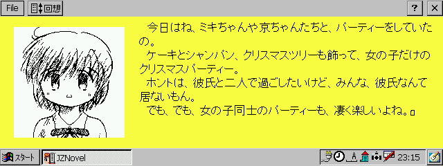
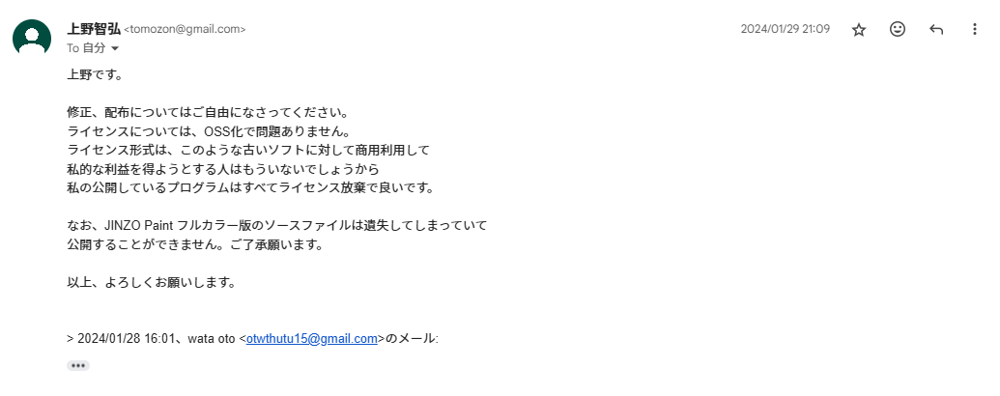

# JINZO Novel



JINZO Novel is an easy-to-play digital novel system for Windows CE. You can create data using a text editor and drawing software, making it possible to create data on a Windows CE device.

JINZO Novel は、Windows CE で動作するディジタルノべルシステムです。簡単な操作で、お手軽にプレイ出来ます。また、テキストエディタとお絵描きソフトで簡単にデータを作成出来るので、Windows CE だけでデータの作成を行うことも可能です。

- [Official Website](http://www.tomozon.sakura.ne.jp/wince/)
- [Documentation](./JZNovel-Doc.txt)
- [Tag Documentation](./JZNovel_100_TAG_DOC.txt)

## License

This software is distributed here under the [MIT License](LICENSE), with the permission of the original author [Tomohiro Ueno](http://www.tomozon.sakura.ne.jp/wince/), expressed in the following e-mail reply.

本ソフトウェアは、作者である[上野智弘](http://www.tomozon.sakura.ne.jp/wince/)様から電子メールでの許諾を得た上で、[MIT License](LICENSE) の下で配布しています。以下に実際の文面を記します。



```
上野です。

修正、配布についてはご自由になさってください。
ライセンスについては、OSS化で問題ありません。
ライセンス形式は、このような古いソフトに対して商用利用して
私的な利益を得ようとする人はもういないでしょうから
私の公開しているプログラムはすべてライセンス放棄で良いです。

なお、JINZO Paint フルカラー版のソースファイルは遺失してしまっていて
公開することができません。ご了承願います。

以上、よろしくお願いします。
```
